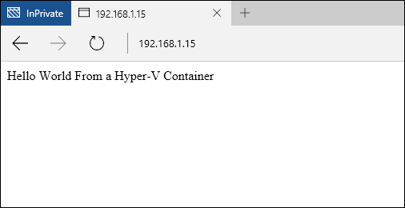

## TP4 Feature Quick Start

This quick start will introduce the following items:
- Hyper-V Container
- Container with Nano Server Base OS Image
- Shared Folder
- Container Resource Constraint

To completed this TP4 Quick Start, you need a physical or virtual system running Windows Server 2016 TP4 (Full UI, Core, or Nano), and the system must meet the nested virtualization requirements for Hyper-V containers.

<Insert link for configuration guide>

<Insert link for Hyper-V requirements>

## Create Hyper-V Container

At the time of TP4 Hyper-V containers must use a Nano Server Core OS Image. To validate that the Nano Server Core OS image has been installed on the Container Host, use the **Get-ContainerImage** command.

```powershell
PS C:\> Get-ContainerImage
Name              Publisher    Version         IsOSImage
----              ---------    -------         ---------
NanoServer        CN=Microsoft 10.0.10586.1000 True
WindowsServerCore CN=Microsoft 10.0.10586.1000 True
```

To create a Hyper-V container use the **New-Container** command specifying a Runtime of HyperV.

```powershell
PS C:\> $con = New-Container -Name HYPV -ContainerImageName NanoServer -SwitchName "Virtual Switch" -RuntimeType HyperV
```

When the container has been created, do not start it.

For more information on managing Windows Containers, see the Managing Containers Technical Guide - <>

## Configure Container Network

The default network configuration for the Windows Container Quick Starts is to have the containers connected to a virtual switch configured with Network Address Translation (NAT). Because of this, in order to connect to an application running inside of a container, a port on the container host needs to be mapped to a port on the container. This can be done with the **Add-NetNatStaticMapping** command.

For this exercise, a website will be hosted on IIS running inside of a container. To access the website on port 80, map port 80 of the container host to port 80 of the container.

> NOTE – if running multiple containers on your host you will need to verify the IP address of the container and also that port 80 of the host is not already mapped to a running container. 

To create the port mapping, run the following command.

```powershell
Add-NetNatStaticMapping -NatName "ContainerNat" -Protocol TCP -ExternalIPAddress 0.0.0.0 -InternalIPAddress 172.16.0.2 -InternalPort 80 -ExternalPort 80
```
You will also need to open up port 80 on the container host.

```powershell
if (!(Get-NetFirewallRule | where {$_.Name -eq "TCP80"})) {
    New-NetFirewallRule -Name "TCP80" -DisplayName "HTTP on TCP/80" -Protocol tcp -LocalPort 80 -Action Allow -Enabled True
}
```

## Create a Shared Folder

Create a folder at the root of your container named ‘shared’.
```powershell
PS C:\> New-Item -Type Directory c:\share
```

Windows Container Shared Folders provide a way of sharing data between both the container host and container and between containers themselves. We will use a shared folder during this exercise to copy files into a container which will be used to configure an application.

Use the **Add-ContainerSharedFolder** command to create a shared folder.

> The container must be in a stopped stated when creating the shared folder.

```powershell
PS C:\> Add-ContainerSharedFolder -Container $con -SourcePath c:\share -DestinationPath c:\share
ContainerName SourcePath DestinationPath AccessMode
------------- ---------- --------------- ----------
HYPV          c:\share   c:\share        ReadWrite
```

When the shared folder has been created, start the container.
```powershell
Start-Container $con
```
Create a PowerShell remote session with the container using the **Enter-PSSession** command.

```powershell
PS C:\> Enter-PSSession -ContainerId $con.ContainerId –RunAsAdministrator
```
When in the remote session, notice that a directory has been created ‘c:\share’, and that you can now copy files into the c:\share directory of the host and access them in the container.

For more information on Shared Folder, see the [Shared Folders Technical Guide](../user_guide/manage_data.md)

## Install IIS in the Container

Because your container is running a Windows Server Nano OS Image, to install IIS we will need to use IIS packages for Nano Server.

The IIS packages can be found on the Windows Sever Installation media under the **NanoServer\Packages** directory.

```powershell
D:\NanoServer\Packages
```
Copy the Microsoft-NanoServer-IIS-Package.cab from NanoServer\Packages to c:\source on your container host. Next copy NanoServer\Packages\en-us\Microsoft-NanoServer-IIS-Package.cab to c:\source\en-us on your container host.

Alternatively, use this script to complete this for you. Replace the **mediaPath** value with that of the Windows Server Media

```powershell
<insert script>
```
Create a file in the shared folder named unattend.xml, copy these lines into the unattend.xml file.

```powershell
<?xml version="1.0" encoding="utf-8"?>
<unattend xmlns="urn:schemas-microsoft-com:unattend">
    <servicing>
        <package action="install">
            <assemblyIdentity name="Microsoft-NanoServer-IIS-Package" version="10.0.10586.1000" processorArchitecture="amd64" publicKeyToken="31bf3856ad364e35" language="neutral" />
            <source location="c:\share\Microsoft-NanoServer-IIS-Package.cab" />
        </package>
        <package action="install">
            <assemblyIdentity name="Microsoft-NanoServer-IIS-Package" version="10.0.10586.1000" processorArchitecture="amd64" publicKeyToken="31bf3856ad364e35" language="en-US" />
            <source location="c:\share\en-us\Microsoft-NanoServer-IIS-Package.cab" />
        </package>
    </servicing>
</unattend>
```
From inside the container run the following commands to install IIS.

```powershell
dism /online /apply-unattend:c:\share\unattend.xml
```

Restart Container - is this really needed?

```powershell
PS C:\> Stop-Container $con
PS C:\> Start-Container $con
```
Now, using an internet browser, browse to the IP Address of the container host. You will see the IIS splash screen.


## Create IIS Container Image

Stop the Container.

```powershell
Stop-Container $con
```

Create new container images from container.

```powershell
PS C:\> New-ContainerImage -Container $con -Name NanoServerIIS -Publisher Demo -Version 1.0
```

Run **Get-ContainerImage** to see a complete list of images available on the container host. Notice in the output that a differentiation is made between OS Images and non OS images.

```powershell

PS C:\> Get-ContainerImage
Name              Publisher    Version         IsOSImage
----              ---------    -------         ---------
NanoServerIIS     CN=Demo      1.0.0.0         False
NanoServer        CN=Microsoft 10.0.10586.1000 True
WindowsServerCore CN=Microsoft 10.0.10586.1000 True
```

## Deploy IIS Application

So that you can re-use existing port mapping rules, ensure that all containers are stopped.

Create a new container from the IIS image using the **New-Container** command.

```powershell
PS C:\> $con = New-Container -Name IISApp -ContainerImageName nanoserverIIS -SwitchName "Virtual Switch" -RuntimeType HyperV
```

Start the container.

```powershell
PS C:\> Start-Container $con
```

Create a remote PowerShell session with the container.

```powershell
PS C:\> Enter-PSSession -ContainerId $con.ContainerId –RunAsAdministrator
```

Run the following script to replace the default IIS splash screen with a new static site.

```powershell
del C:\inetpub\wwwroot\iisstart.htm
"Hello World From a Hyper-V Container" > C:\inetpub\wwwroot\index.html
```

Browse to the IP Address of the container host and you will now see the ‘Hello World’ application.



## Container Resource Constraint