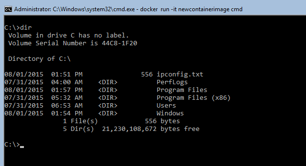
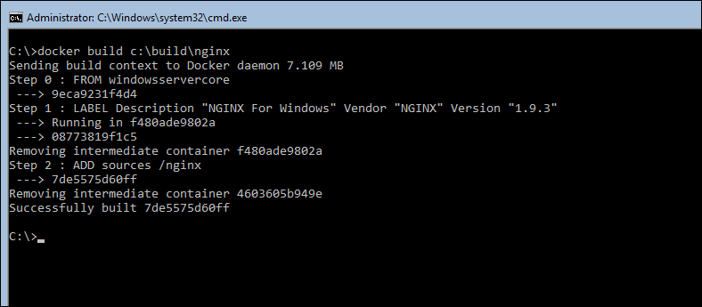

ms.ContentId: 347fa279-d588-4094-90ec-8c2fc241f5b6
title: Manage Windows Server Containers with Docker

#Quick Start: Windows Server Containers and Docker

This article will walk through the fundamentals of managing windows Server Containers with Docker. Items covered will include creating Windows Server Containers and Windows Server Container Images, removing Windows Server Containers and Container Images and finally deploying an application into a Windows Server Container. The lessons learned in this walkthrough should enable you to begin exploring deployment and management of Windows Server Containers using Docker.

Have questions? Ask them on the [Windows Containers forum](https://social.msdn.microsoft.com/Forums/en-US/home?forum=windowscontainers).

> **Note:** Windows Containers created with PowerShell can not currently be managed with Docker and visa versa. To create containers with PowerShell, see  [Quick Start: Windows Server Containers and PowerShell](./manage_powershell.md).

## Prerequisites
In order to complete this walkthrough the following items need to be in place.

- Windows Server 2016 TP3 or later configured with the Windows Server Container Feature.
- This system must be connected to a network and able to access the internet.

If you need to configure the container feature, see the following guides: [Container Setup in Azure](./azure_setup.md) or [Container Setup in Hyper-V](./container_setup.md). 

As you begin this walkthrough you should be at a Windows command prompt.

## Basic Container Management with Docker

This first example will walk through the basics of creating and removing Windows Server Containers and Windows Server Container Images with Docker.

First start a PowerShell session from the command prompt by typing `PowerShell`. You will know that you are in a PowerShell session when the prompt changes from ``C:\directory>`` to ``PS C:\directory>``.

```
C:\> powershell
Windows PowerShell
Copyright (C) 2015 Microsoft Corporation. All rights reserved.

PS C:\>
```

### Step 1 - Create a New Container

Before creating a Windows Server Container with Docker you will need the name or ID of an exsisitng Windows Server Container image.

To see all images loaded on the container host use the `docker images` command.

``` PowerShell
docker images

REPOSITORY          TAG                 IMAGE ID            CREATED             VIRTUAL SIZE
windowsservercore   latest              9eca9231f4d4        30 hours ago        9.613 GB
windowsservercore   10.0.10254.0        9eca9231f4d4        30 hours ago        9.613 GB
```

Now, use `docker run` To create a new Windows Server Container. This command instructs the Docker daemon to create a new container named ‘dockerdemo’ from the image ‘windowsservercore’ and open an interactive (-it) console session (cmd) with the container.

``` PowerShell
docker run -it --name dockerdemo windowsservercore cmd
```
When the command completes you will be working in a console session on the container.

Working in a container is almost identical to working with Windows installed on a virtual or physical machine. You can run commands such as `ipconfig` to return the IP address of the container, `mkdir` to create a new directory, or `powershell` to start a PowerShell session. Go ahead and make a change to the container such as creating a file or folder. For example, the following command will create a file which contains network configuration data about the container.

``` PowerShell
ipconfig > c:\ipconfig.txt
```

You can read the contents of the file to ensure the command completed successfully. Notice that the IP address contained in the text file matches that of the container.

``` PowerShell
Type c:\ipconfig.txt

Ethernet adapter vEthernet (Virtual Switch-94a3e12ad262b3059e08edc4d48fca3c8390e38c3b219023d4a0a4951883e658-0):

   Connection-specific DNS Suffix  . : 
   Link-local IPv6 Address . . . . . : fe80::cc1f:742:4126:9530%18
   IPv4 Address. . . . . . . . . . . : 172.16.0.2
   Subnet Mask . . . . . . . . . . . : 255.240.0.0
   Default Gateway . . . . . . . . . : 172.16.0.1
```

Now that the container has been modified, run the following to stop the console session placing you back in the console session of the container host.

``` PowerShell
exit
```

Finally to see a list of containers on the container host use the `docker ps –a` command. Notice in the output a container named 'dockerdemo' has been created.

``` PowerShell
docker ps -a

CONTAINER ID        IMAGE               COMMAND        CREATED             STATUS                     PORTS     NAMES
4f496dbb8048        windowsservercore   "cmd"          2 minutes ago       Exited (0) 2 minutes ago             dockerdemo
``` 

### Step 2 - Create a New Container Image

An image can now be made from this container. This image will behave like a snapshot of the container and can be re-deployed many times.

To create a new image run the following. This command instructs the Docker engine to create a new image named 'newcontainerimage' that will include all changes made to the 'deckerdemo' container.

``` PowerShell
docker commit dockerdemo newcontainerimage
```

To see all images on the host, run `docker images`. Notice that a new image has been created with the name 'newcontainerimage'.

``` PowerShell
docker images

REPOSITORY          TAG                 IMAGE ID            CREATED             VIRTUAL SIZE
newcontainerimage   latest              4f8ebcf0a334        2 minutes ago       9.613 GB
windowsservercore   latest              9eca9231f4d4        30 hours ago        9.613 GB
windowsservercore   10.0.10254.0        9eca9231f4d4        30 hours ago        9.613 GB
```

### Step 3 - Create New Container From Image

Now that you have a custom container image, deploy a new container named 'newcontainer' from 'newcontainerimage' and open an interactive shell session with the container.

``` PowerShell
docker run –it --name newcontainer newcontainerimage cmd
```

Take a look at the c:\ drive of this new container and notice that the ipconfig.txt file is present.



Exit the newly created container to return to the container hosts console session.

``` PowerShell
exit
```

This exercise has shown that an image taken from a modified container will include all modifications. While the example here was a simple file modification, the same would apply if you were to install software into the container such as a web server. Using these methods, custom images can be created that will deploy application ready containers.

### Step 4 - Remove Containers and Images

To remove a container after it is no longer needed use the `docker rm` command. The following command will remove the container name 'newcontainer'.

``` PowerShell
docker rm newcontainer
```
To remove container images when they are no longer needed use the `docker rmi` command. You cannot remove an image if it is referenced by an existing container.

The following command removes the container image named 'newcontainerimage'.
``` PowerShell
docker rmi newcontainerimage

Untagged: newcontainerimage:latest
Deleted: 4f8ebcf0a334601e75070a92294d993b0f182abb6f4c88740c75b05093e6acff
```

## Host a Web Server in a Container

This next example will demonstrate a more practical use case for Windows Server Containers. The steps included in this exercise will guide you through creating a web server container image that can be used for deploying web applications hosted inside of a Windows Server Container.

### Step 1 - Download Web Server Software

Before creating a container image the web server software will need to be downloaded and staged on the container host. We will be using the nginx for Windows software for this example. **Note** that this step will require the container host to be connected to the internet. If this step produces a connectivity or name resolution error check the network configuration of the container host.

Run the following command on the container host to create the directory structure that will be used for this example.

``` PowerShell
mkdir c:\build\nginx\source
```

Run this command on the container host to download the nginx software to 'c:\nginx-1.9.3.zip'.

``` PowerShell
wget -uri 'http://nginx.org/download/nginx-1.9.3.zip' -OutFile "c:\nginx-1.9.3.zip"
```

Finally the following command will extract the nginx software to 'C:\build\nginx\source'. 

``` PowerShell
Expand-Archive -Path C:\nginx-1.9.3.zip -DestinationPath C:\build\nginx\source -Force
```

### Step 2 - Create Web Server Image
In the previous example, you manually created, updated and captured a container image. This example will demonstrate an automated method for creating container images using a Dockerfile. Dockerfiles contain instructions that the Docker engine uses to build and modify a container, and then commit the container to a container image. 
For more information on dockerfiles, see [Dockerfile reference](https://docs.docker.com/reference/builder/).

Use the following command to create an empty dockerfile.

``` PowerShell
new-item -Type File c:\build\nginx\dockerfile
```
Open the dockerfile with notepad.

```
notepad.exe c:\build\nginx\dockerfile
```

Copy and paste the following text into notepad, save the file and close notepad.

``` PowerShell
FROM windowsservercore
LABEL Description="nginx For Windows" Vendor="nginx" Version="1.9.3"
ADD source /nginx
```

At this point the dockerfile will be in 'c:\build\nginx' and the nginx software extracted to 'c:\build\nginx\source'. 
You are now ready to build the web server container image based on the instructions in the dockerfile. To do this, run the following command on the container host.

``` PowerShell
docker build -t nginx_windows C:\build\nginx
```
This command instructs the docker engine to use the dockerfile located at `C:\build\nginx` to create an image named 'nginx_windows'.

The output will look similar to this:



When completed, take a look at the images on the host using the `docker images` command. You should see a new image named 'nginx_windows'.
``` PowerShell
docker images

REPOSITORY          TAG                 IMAGE ID            CREATED             VIRTUAL SIZE

nginx_windows       latest              d792268338d0        5 seconds ago       9.613 GB
windowsservercore   10.0.10254.0        9eca9231f4d4        35 hours ago        9.613 GB
windowsservercore   latest              9eca9231f4d4        35 hours ago        9.613 GB
```

### Step 3 – Configure Networking for Container Application
Because you will be hosting a website inside of a container a few networking related configurations need to be made. First a firewall rule needs to be created on the container host that will allow access to the website. In this example we will be accessing the site through port 80. Run the following script to create this firewall rule.

``` powershell
if (!(Get-NetFirewallRule | where {$_.Name -eq "TCP80"})) {
    New-NetFirewallRule -Name "TCP80" -DisplayName "HTTP on TCP/80" -Protocol tcp -LocalPort 80 -Action Allow -Enabled True
}
```

Next if you are working from Azure and have not already created a Virtual Machine endpoint you will need to create one now. For more information on Azure VM Endpoints see this article: [Set up Azure VM Endpoints]( https://azure.microsoft.com/en-us/documentation/articles/virtual-machines-set-up-endpoints/).

### Step 4 - Deploy Web Server Ready Container

To deploy a Windows Server Container based off of the 'nginx_windows' container run the following command. This will create a new container named 'nginxcontainer' and start an console session on the container. The –p 80:80 portion of this command creates a port mapping between port 80 on the host to port 80 on the container. 

``` powershell
docker run -it --name nginxcontainer -p 80:80 nginx_windows cmd
```
Once working inside the container, the nginx web server can be started and web content staged. To start the nginx web server, change to the nginx installation directory.

``` powershell
cd c:\nginx\nginx-1.9.3
```

Start the nginx web server.
``` powershell
start nginx
```
### Step 5 – Access the Container Hosted Website

With the web server container created and all networking configured, you can now checkout the application hosted in the container. To do so, get the ip address of the container host using `ipconfig`, open up a browser on different machine and enter `http://containerhost-ipaddress`. If everything has been correctly configured, you will see the nginx welcome page.


At this point, feel free to update the website. Copy in your own sample website, or run the following command to replace the nginx welcome page with a ‘Hello World’ web page.

```powershell
powershell wget -uri 'https://raw.githubusercontent.com/Microsoft/Virtualization-Documentation/master/doc-site/virtualization/windowscontainers/quick_start/SampleFiles/index.html' -OutFile "C:\nginx\nginx-1.9.3\html\index.html"
```

After the website has been updated, navigate back to `http://containerhost-ipaddress`.


-----------------------------------
[Back to Container Home](../containers_welcome.md)   
[Known Issues for Current Release](../about/work_in_progress.md)