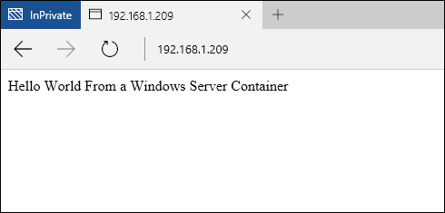

# Windows Containers Quick Start - PowerShell

Windows Containers can be used to rapidly deploy many isolated applications on a single computer system. This quick start demonstrates deployment and management of both Windows Server and Hyper-V containers using PowerShell. Throughout this exercise you will build from the ground up a very simple ‘hello world’ application, running in both a Windows Server and a Hyper-V Container. During this process, you will create container images, work with container shared folders, and manage the container lifecycle. When completed, you will have a basic understanding of Windows Container deployment and management.

This walkthrough details both Windows Server containers and Hyper-V containers. Each type of container has its own basic requirements. Included with the Windows Container documentation is a procedure for quickly deploying a container host. This is the easiest way to quickly start with Windows Containers. If you do not already have a container host, see the [Container Host Deployment Quick Start](./container_setup.md).

The following items are required for each exercise.

**Windows Server Containers:**

- A Windows Container Host running Windows Server 2016 Core, either on-prem or in Azure.

**Hyper-V Containers:**

- A Windows Container host enabled with Nested Virtualization.
- The Windows Server 2016 Media - [Download](https://aka.ms/tp4/serveriso).

> Microsoft Azure does not support Hyper-V containers. To complete the Hyper-V exercises, you need an on-prem container host.

## Windows Server Container

Windows Server Containers provide an isolated, portable, and resource controlled operating environment for running applications and hosting processes. Windows Server Containers provide isolation between the container and host, and between containers running on the host, through process and namespace isolation.

### Create Container <!--1-->

At the time of TP4, Windows Server Containers running on a Windows Server 2016, or a Windows Server 2016 core, require the Windows Server 2016 Core OS Image.

Start a PowerShell session by typing `powershell`.

```powershell
C:\> powershell
Windows PowerShell
Copyright (C) 2015 Microsoft Corporation. All rights reserved.

PS C:\>
```

To validate that the Windows Server Core OS Image has been installed, use the `Get-ContainerImage` command. You may see multiple OS images, which is ok.

```powershell
PS C:\> Get-ContainerImage

Name              Publisher    Version      IsOSImage
----              ---------    -------      ---------
NanoServer        CN=Microsoft 10.0.10586.0 True
WindowsServerCore CN=Microsoft 10.0.10586.0 True
```

To create a Windows Server Container, use the `New-Container` command. The below example creates a container named `TP4Demo` from the `WindowsServerCore` OS Image, and connects the container to a Container Network named `nat`. 

```powershell
PS C:\> New-Container -Name TP4Demo -ContainerImageName WindowsServerCore -NetworkName "nat"

Name    State Uptime   ParentImageName
----    ----- ------   ---------------
TP4Demo Off   00:00:00 WindowsServerCore
```

To visualize exisiting containers, use the `Get-Container` command.

```powershell
PS C:\> Get-Container

Name    State Uptime   ParentImageName
----    ----- ------   ---------------
TP4Demo Off   00:00:00 WindowsServerCore
```

Start the container using the `Start-Container` command.

```powershell
PS C:\> Start-Container -Name TP4Demo
```

Connect to the container using the `Enter-PSSession` command. Notice that when the PowerShell session has been created with the container, the PowerShell prompt changes to reflect the container name.

```powershell
PS C:\> Enter-PSSession -ContainerName TP4Demo -RunAsAdministrator

[TP4Demo]: PS C:\Windows\system32>
```

### Create IIS Image <!--1-->

Now the container can be modified, and these modifications captured to create a new container image. For this example, IIS is installed.

To install the IIS role in the container, use the `Install-WindowsFeature` command.

```powershell
[TP4Demo]: PS C:\> Install-WindowsFeature web-server

Success Restart Needed Exit Code      Feature Result
------- -------------- ---------      --------------
True    No             Success        {Common HTTP Features, Default Document, D...
```

When the IIS installation has completed, exit the container by typing `exit`. This returns the PowerShell session to that of the container host.

```powershell
[TP4Demo]: PS C:\> exit
PS C:\>
```

Finally, stop the container using the `Stop-Container` command.

```powershell
PS C:\> Stop-Container -Name TP4Demo
```

The state of this container can now be captured into a new container image. Do so using the `New-ContainerImage` command.

This example creates a new container image named `WindowsServerCoreIIS`, with a publisher of `Demo`, and a version `1.0`.

```powershell
PS C:\> New-ContainerImage -ContainerName TP4Demo -Name WindowsServerCoreIIS -Publisher Demo -Version 1.0

Name                 Publisher Version IsOSImage
----                 --------- ------- ---------
WindowsServerCoreIIS CN=Demo   1.0.0.0 False
```

Now that the container has been captured into the new image, it is no longer needed. You may remove it using the `Remove-Container` command.

```powershell
PS C:\> Remove-Container -Name TP4Demo -Force
```


### Create IIS Container <!--1-->

Create a new container, this time from the `WindowsServerCoreIIS` container image.

```powershell
PS C:\> New-Container -Name IIS -ContainerImageName WindowsServerCoreIIS -NetworkName "nat"

Name State Uptime   ParentImageName
---- ----- ------   ---------------
IIS  Off   00:00:00 WindowsServerCoreIIS
```    

### Configure Networking <!--1-->

The default network configuration for the Windows Container Quick Starts, is to have containers connected to a Network Address Translation (NAT) container network. You can see the current container networks available by using the Get-ContainerNetwork command.

```powershell
PS C:\> Get-ContainerNetwork

Name Id                                   Subnets         Mode SourceMac DNSServers    DNSSuffix
---- --                                   -------         ---- --------- ----------    ---------
nat  c475d31c-fb42-408e-8493-6db6c9586915 {172.16.0.0/24} NAT            {192.168.1.1}
```

Because we are using a NAT and want external clients to be able to connect to an application running inside of a container, a port on the container host, needs to be mapped to a port on the container. For detailed information on container networking see [Container Networking](../management/container_networking.md).

For this exercise, a website is hosted in IIS, running inside of a container. To access the website on port 80, map port 80 of the container host to port 80 on the container network adapter. (The container must be stopped to add the port mapping).

First, determine the name of the container network adapter.

```powershell
PS C:\> Get-ContainerNetworkAdapter IIS

ContainerName Name            Network Id                           Static MacAddress Static IPAddress Maximum Bandwidth
------------- ----            ----------                           ----------------- ---------------- -----------------
IIS           Network Adapter C475D31C-FB42-408E-8493-6DB6C9586915                                    0
```

Next, create a static mapping using the Add-ContainerNetworkAdapterStaticMapping cmdlet. 

```powershell
PS C:\> Add-ContainerNetworkAdapterStaticMapping IIS -AdapterName "Network Adapter" -ExternalPort 80
 -InternalPort 80 -Protocol TCP
```

Beginning with TP5, a firewall rule will be automatically created to correspond to this static port mapping - there is no longer a need to create a new rule.

If you are working in Azure, and have not already created a Network Security Group, you need to create one now. For more information on Network Security Groups see this article: [What is a Network Security Group](https://azure.microsoft.com/en-us/documentation/articles/virtual-networks-nsg/).

### Create Application <!--1-->

Now that a container has been created from the IIS image, and networking configured, start the container.

```powershell
PS C:\> Start-Container -Name IIS
```

Open up a browser and browse to the IP address of the container host. You should see the IIS splash screen.


With the IIS instances verified as running, you can now create a ‘Hello World’ application, and host this in the IIS instance. To do so, create a PowerShell session with the container.

```powershell
PS C:\> Enter-PSSession -ContainerName IIS -RunAsAdministrator
[IIS]: PS C:\Windows\system32>
```

Run the following command to remove the IIS splash screen.

```powershell
[IIS]: PS C:\> del C:\inetpub\wwwroot\iisstart.htm
```
Run the following command to replace the default IIS site with a new static site.

```powershell
[IIS]: PS C:\> "Hello World From a Windows Server Container" > C:\inetpub\wwwroot\index.html
```

Browse again to the IP Address of the container host, you should now see the ‘Hello World’ application. Note – you may need to close any existing browser connections, or clear browser cache to see the updated application.



Exit the remote container session.

```powershell
[IIS]: PS C:\> exit
PS C:\>
```

### Remove Container

A container needs to be stopped, before it can be removed.

```powershell
PS C:\> Stop-Container -Name IIS
```

When the container has been stopped, it can be removed with the `Remove-Container` command.

```powershell
PS C:\> Remove-Container -Name IIS -Force
```

Finally, a container image can be removed using the `Remove-ContainerImage` command.

```powershell
PS C:\> Remove-ContainerImage -Name WindowsServerCoreIIS -Force
```

## Hyper-V Container

Hyper-V Containers provide an additional layer of isolation over Windows Server Containers. Each Hyper-V Container is created within a highly optimized virtual machine. Where a Windows Server Container shares a kernel with the Container host, and all other Windows Server Containers running on that host, a Hyper-V container is completely isolated from other containers. Hyper-V Containers are created and managed identically to Windows Server Containers. For more information about Hyper-V Containers see [Managing Hyper-V Containers](../management/hyperv_container.md).

> Microsoft Azure does not support Hyper-V containers. To complete the Hyper-V Container exercises, you need an on-prem container host.

### Create Container <!--2-->

At the time of TP4, Hyper-V containers must use a Nano Server Core OS Image. To validate that the Nano Server OS image has been installed, use the `Get-ContainerImage` command.

```powershell
PS C:\> Get-ContainerImage

Name              Publisher    Version      IsOSImage
----              ---------    -------      ---------
NanoServer        CN=Microsoft 10.0.10586.0 True
WindowsServerCore CN=Microsoft 10.0.10586.0 True
```

To create a Hyper-V container, use the `New-Container` command, specifying a Runtime of HyperV.

```powershell
PS C:\> New-Container -Name HYPV -ContainerImageName NanoServer -NetworkName "nat" -RuntimeType HyperV

Name State Uptime   ParentImageName
---- ----- ------   ---------------
HYPV Off   00:00:00 NanoServer
```

When the container has been created, **do not start it**.

### Create a Shared Folder

Shared folders expose a directory from the container host, to the container. When a shared folder has been created, any files placed in the shared folder are available in the container. A shared folder is used in this example to copy the Nano Server IIS packages into the container. These packages will then be used to install IIS. For more information on shared folder see [Container Shared Folders](../management/manage_data.md). 

Create a directory named `c:\share\en-us` on the container host.

```powershell
PS C:\> New-Item -Type Directory c:\share\en-us

    Directory: C:\share

Mode                LastWriteTime         Length Name
----                -------------         ------ ----
d-----       11/18/2015   5:27 PM                en-us
```

Use the `Add-ContainerSharedFolder` command to create a new shared folder on the new container.

> The container must be in a stopped stated when creating a shared folder.

```powershell
PS C:\> Add-ContainerSharedFolder -ContainerName HYPV -SourcePath c:\share -DestinationPath c:\iisinstall

ContainerName SourcePath DestinationPath AccessMode
------------- ---------- --------------- ----------
HYPV          c:\share   c:\iisinstall   ReadWrite
```

When the shared folder has been created, start the container.

```powershell
PS C:\> Start-Container -Name HYPV
```
Create a PowerShell remote session with the container using the `Enter-PSSession` command.

```powershell
PS C:\> Enter-PSSession -ContainerName HYPV -RunAsAdministrator
[HYPV]: PS C:\windows\system32\config\systemprofile\Documents>cd /
```
When in the remote session, notice that the shared folder `c:\iisinstall\en-us` has been created, however is empty.

```powershell
[HYPV]: PS C:\> ls c:\iisinstall

    Directory: C:\iisinstall

Mode                LastWriteTime         Length Name
----                -------------         ------ ----
d-----       11/18/2015   5:27 PM                en-us
```

### Create IIS Image <!--2-->

Because the container is running a Nano Server OS Image, the Nano Server IIS packages are needed to install IIS. These can be found on the Windows Sever 2016 TP4 Installation media, under the `NanoServer\Packages` directory.

Copy `Microsoft-NanoServer-IIS-Package.cab` from `NanoServer\Packages` to `c:\share` on the container host. 

Copy `NanoServer\Packages\en-us\Microsoft-NanoServer-IIS-Package.cab` to `c:\share\en-us` on the container host.

Create a file in the c:\share folder named unattend.xml, copy this text into the unattend.xml file.

```powershell
<?xml version="1.0" encoding="utf-8"?>
<unattend xmlns="urn:schemas-microsoft-com:unattend">
    <servicing>
        <package action="install">
            <assemblyIdentity name="Microsoft-NanoServer-IIS-Package" version="10.0.10586.0" processorArchitecture="amd64" publicKeyToken="31bf3856ad364e35" language="neutral" />
            <source location="c:\iisinstall\Microsoft-NanoServer-IIS-Package.cab" />
        </package>
        <package action="install">
            <assemblyIdentity name="Microsoft-NanoServer-IIS-Package" version="10.0.10586.0" processorArchitecture="amd64" publicKeyToken="31bf3856ad364e35" language="en-US" />
            <source location="c:\iisinstall\en-us\Microsoft-NanoServer-IIS-Package.cab" />
        </package>
    </servicing>
</unattend>
```

When completed, the `c:\share` directory, on the container host, should be configured like this.

```
c:\share
|-- en-us
|    |-- Microsoft-NanoServer-IIS-Package.cab
|
|-- Microsoft-NanoServer-IIS-Package.cab
|-- unattend.xml
```

Back in the remote session on the container, note that the IIS packages and unattended.xml files are now visible in the c:\iisinstall directory.

```powershell
[HYPV]: PS C:\> ls c:\iisinstall

    Directory: C:\iisinstall

Mode                LastWriteTime         Length Name
----                -------------         ------ ----
d-----       11/18/2015   5:32 PM                en-us
-a----       10/29/2015  11:51 PM        1922047 Microsoft-NanoServer-IIS-Package.cab
-a----       11/18/2015   5:31 PM            789 unattend.xml
```

Run the following command to install IIS.

```powershell
[HYPV]: PS C:\> dism /online /apply-unattend:c:\iisinstall\unattend.xml

Deployment Image Servicing and Management tool
Version: 10.0.10586.0

Image Version: 10.0.10586.0


[                           1.0%                           ]

[=====                      10.1%                          ]

[=====                      10.3%                          ]

[===============            26.2%                          ]
```

When the IIS installation has complete, manually start IIS with the following command.

```powershell
[HYPV]: PS C:\> Net start w3svc
The World Wide Web Publishing Service service is starting.
The World Wide Web Publishing Service service was started successfully.
```

Exit the container session.

```powershell
[HYPV]: PS C:\> exit
```

Stop the container.

```powershell
PS C:\> Stop-Container -Name HYPV
```

The state of this container can now be captured into a new container image.

This example creates a new container image named `NanoServerIIS`, with a publisher of `Demo`, and a version `1.0`.

```powershell
PS C:\> New-ContainerImage -ContainerName HYPV -Name NanoServerIIS -Publisher Demo -Version 1.0

Name          Publisher Version IsOSImage
----          --------- ------- ---------
NanoServerIIS CN=Demo   1.0.0.0 False
```

### Create IIS Container <!--2-->

Create a new Hyper-V container from the IIS image using the `New-Container` command.

```powershell
PS C:\> New-Container -Name IISApp -ContainerImageName NanoServerIIS -NetworkName "nat" -RuntimeType HyperV

Name   State Uptime   ParentImageName
----   ----- ------   ---------------
IISApp Off   00:00:00 NanoServerIIS
```

Start the container.

```powershell
PS C:\> Start-Container -Name IISApp
```

### Configure Networking <!--2-->

The default network configuration for the Windows Container Quick Starts, is to have containers connected to a Network Address Translation (NAT) container network. You can see the current container networks available by using the Get-ContainerNetwork command.

```powershell
PS C:\> Get-ContainerNetwork

Name Id                                   Subnets         Mode SourceMac DNSServers    DNSSuffix
---- --                                   -------         ---- --------- ----------    ---------
nat  c475d31c-fb42-408e-8493-6db6c9586915 {172.16.0.0/24} NAT            {192.168.1.1}
```


Because we are using a NAT and want external clients to be able to connect to an application running inside of a container, a port on the container host, needs to be mapped to a port on the container. For detailed information on container networking see [Container Networking](../management/container_networking.md).

For this exercise, a website is hosted in IIS, running inside of a container. To access the website on port 80, map port 80 of the container host to port 80 on the container network adapter. (The container must be stopped to add the port mapping).

First, determine the name of the container network adapter.

```powershell
PS C:\> Get-ContainerNetworkAdapter IISApp

ContainerName Name            Network Id                           Static MacAddress Static IPAddress Maximum Bandwidth
------------- ----            ----------                           ----------------- ---------------- -----------------
IISApp           Network Adapter C475D31C-FB42-408E-8493-6DB6C9586915                                    0
```

Next, create a static mapping using the Add-ContainerNetworkAdapterStaticMapping cmdlet. 

```powershell
PS C:\> Add-ContainerNetworkAdapterStaticMapping IISApp -AdapterName "Network Adapter" -ExternalPort 80
 -InternalPort 80 -Protocol TCP
```

Beginning with TP5, a firewall rule will be automatically created to correspond to this static port mapping - there is no longer a need to create a new rule.

If you are working in Azure, and have not already created a Network Security Group, you need to create one now. For more information on Network Security Groups see this article: [What is a Network Security Group](https://azure.microsoft.com/en-us/documentation/articles/virtual-networks-nsg/).

### Create Application <!--1-->

Now that a container has been created from the IIS image, and networking configured, start the container.

```powershell
PS C:\> Start-Container -Name IIS
```

Open up a browser and browse to the IP address of the container host. You should see the IIS splash screen.

### Create Application <!--2-->

Now that a container has been created from the IIS image, and networking configured, open up a browser and browse to the IP address of the container host, you should see the IIS splash screen.


With the IIS instances verified as running, you can now create a ‘Hello World’ application, and host this on the IIS instance. To do so, create a PowerShell session with the container.

```powershell
PS C:\> Enter-PSSession -ContainerName IISApp -RunAsAdministrator
[IISApp]: PS C:\windows\system32\config\systemprofile\Documents>
```

Run the following command to remove the IIS splash screen.

```powershell
[IISApp]: PS C:\> del C:\inetpub\wwwroot\iisstart.htm
```
Run the following command to replace the default IIS site with a new static site.

```powershell
[IISApp]: PS C:\> "Hello World From a Hyper-V Container" > C:\inetpub\wwwroot\index.html
```

Browse again to the IP Address of the container host, you should now see the ‘Hello World’ application. Note – you may need to close any existing browser connections, or clear browser cache to see the updated application.


Exit the remote container session.

```powershell
exit
```
