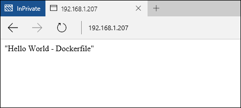

# Container Images on Windows Server

**This is preliminary content and subject to change.** 


In the previous Windows Server quick start, a Windows container was created from a pre-existing container image. This exercise will detail creating your own container images manually and creating images using a Dockerfile.

**Prerequisites:**

One computer system (physical or virtual) running [Windows Server 2016 Technical Preview 5](https://www.microsoft.com/en-us/evalcenter/evaluate-windows-server-technical-preview).

Configure this system with the Windows Container feature and Docker. For a walkthrough on these steps, see [Windows Containers on Windows Server](./quick_start_windows_server.md).

> This quick start is specific to Windows Server containers on Windows Server 2016. Additional quick start documentation can be found in the table of contents on the left hand side of this page.  

## 1. Container Image - Manual

> For the best experience, walk through this exercise from a Windows command shell (cmd.exe).

The first step in manually creating a container image is to deploy a container. For this example, deploy an IIS container from the pre-created IIS image. Once the container has been deployed, you will be working in a shell session from within the container. The interactive session is initiated with the `-it` flag. For in depth details on Docker Run commands, see [Docker Run Reference on Docker.com]( https://docs.docker.com/engine/reference/run/). 

```none
docker run -it -p 80:80 microsoft/iis:windowsservercore cmd
```

Next, a modification will be made to container. Run the following command to remove the IIS splash screen.

```none
del C:\inetpub\wwwroot\iisstart.htm
```

And the following to replace the default IIS site with a new static site.

```none
echo "Hello World From a Windows Server Container" > C:\inetpub\wwwroot\index.html
```

From a different system, browse to the IP address of the container host. You should now see the ‘Hello World’ application.


Back in the container, exit the interactive container session.

```none
exit
```

The modified container can now be captured into a new container image. To do so, you will need the container name. This can be found using the `docker ps -a` command.

```none
docker ps -a

CONTAINER ID     IMAGE                             COMMAND   CREATED             STATUS   PORTS   NAMES
489b0b447949     microsoft/iis:windowsservercore   "cmd"     About an hour ago   Exited           pedantic_lichterman
```

To create a the new container image, use the `docker commit` command. Docker commit takes a form of “docker commit container-name new-image-name”. Note – replace the name of the container in this example with the actual container name.

```none
docker commit pedantic_lichterman modified-iis
```

To verify that new image has been created, use the `docker images` command.  

```none
docker images

REPOSITORY          TAG                 IMAGE ID            CREATED              SIZE
modified-iis        latest              3e4fdb6ed3bc        About a minute ago   10.17 GB
microsoft/iis       windowsservercore   c26f4ceb81db        2 weeks ago          9.48 GB
windowsservercore   10.0.14300.1000     dbfee88ee9fd        8 weeks ago          9.344 GB
windowsservercore   latest              dbfee88ee9fd        8 weeks ago          9.344 GB
```

This image can now be deployed. The resulting container will include all captured modifications.

## 2. Container Image - Dockerfile

Through the last exercise, a container was manually created, modified, and then captured into a new container image. Docker includes a method for automating this process using what is called a Dockerfile. This exercise will have almost identical results as the last, however this time the process will be automated.

On the container host, create a directory `c:\build`, and in this directory create a file named `Dockerfile`. Note – the file should not have a file extension.

```none
powershell new-item c:\build\Dockerfile -Force
```

Open the Dockerfile in notepad.

```none
notepad c:\build\Dockerfile
```

Copy the following text into the Dockerfile, and save the file. These commands instruct Docker to create a new image, using `microsoft/iis` as the base. The dockerfile then runs the commands specified in the `RUN` instruction, in this case the index.html file is updated with new content. 

For more information on Dockerfiles, see the [Dockerfiles on Windows](../docker/manage_windows_dockerfile.md).

```none
FROM microsoft/iis:windowsservercore
RUN echo "Hello World - Dockerfile" > c:\inetpub\wwwroot\index.html
```

The `docker build` command will start the image build process. The `-t` parameter instructs the build process to name the new image `iis-dockerfile`.

```none
docker build -t iis-dockerfile c:\Build
```

When completed, you can verify that the image has been created using the `docker images` command.

```none
docker images

REPOSITORY          TAG                 IMAGE ID            CREATED             SIZE
iis-dockerfile      latest              8d1ab4e7e48e        2 seconds ago       9.483 GB
microsoft/iis       windowsservercore   c26f4ceb81db        2 weeks ago         9.48 GB
windowsservercore   10.0.14300.1000     dbfee88ee9fd        8 weeks ago         9.344 GB
windowsservercore   latest              dbfee88ee9fd        8 weeks ago         9.344 GB
```

Now, deploy a container with the following command. 

```none
docker run -d -p 80:80 iis-dockerfile ping -t localhost
```

Once the container has been created, browse to the IP address of the container host. You should see the hello world application.



Back on the container host, use `docker ps` to get the name of the container, and `docker rm` to remove the container. Note – replace the name of the container in this example with the actual container name.

Get container name.

```none
docker ps

CONTAINER ID   IMAGE            COMMAND               CREATED              STATUS              PORTS                NAMES
c1dc6c1387b9   iis-dockerfile   "ping -t localhost"   About a minute ago   Up About a minute   0.0.0.0:80->80/tcp   cranky_brown
```

Remove container.

```none
docker rm -f cranky_brown
```

## Next Steps

[Windows Containers on Windows 10](./quick_start_windows_10.md)