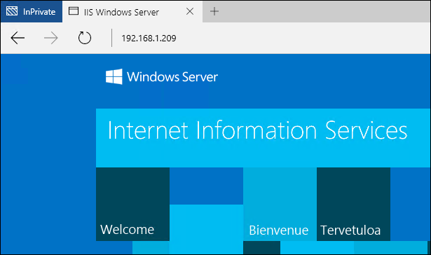

# Windows Containers on Windows Server

**This is preliminary content and subject to change.**

This exercise will walk through basic deployment and use of the Windows container feature on Windows Server. After completion, you will have installed the container role and have deployed a simple Windows Server container. Before starting this quick start, familiarize yourself with basic container concepts and terminology. This information can be found in the [Quick Start Introduction](./quick_start.md).

This quick start is specific to Windows Server containers on Windows Server 2016. Additional quick start documentation can be found in the table of contents on the left hand side of this page.

**Prerequisites:**

One computer system (physical or virtual) running [Windows Server 2016 Technical Preview 5](https://www.microsoft.com/en-us/evalcenter/evaluate-windows-server-technical-preview).

A fully configured Windows Server image is available in Azure. To use this image, deploy a virtual machine by clicking on the button below. The deployment will take about 10 minutes. Once it is complete, log into the Azure virtual machine and skip to step four of this tutorial. 

<a href="https://portal.azure.com/#create/Microsoft.Template/uri/https%3A%2F%2Fraw.githubusercontent.com%2FMicrosoft%2FVirtualization-Documentation%2Fmaster%2Fwindows-server-container-tools%2Fcontainers-azure-template%2Fazuredeploy.json" target="_blank">
    
</a>

## 1. Install Container Feature

The container feature needs to be enabled before working with Windows containers. To do so run the following command in an elevated PowerShell session.

```none
Install-WindowsFeature containers
```

When the feature installation has completed, reboot the computer.

```none
Restart-Computer -Force
```

## 2. Install Docker

Docker is required in order to work with Windows containers. Docker consists of the Docker Engine, and the Docker client. For this exercise, both will be installed.

Download the Docker engine and client as a zip archive.

```none
Start-BitsTransfer -Source "https://get.docker.com/builds/Windows/x86_64/docker-1.12.0.zip" -Destination "$env:TEMP\docker-1.12.0.zip"
```

Expand the zip archive into Program Files.

```none
Expand-Archive -Path "$env:TEMP\docker-1.12.0.zip" -DestinationPath $env:ProgramFiles
```

Add the Docker directory to the system path.

```none
# For quick use, does not require shell to be restarted.
$env:path += ";c:\program files\docker"

# For persistent use, will apply even after a reboot. 
[Environment]::SetEnvironmentVariable("Path", $env:Path + ";C:\Program Files\Docker", [EnvironmentVariableTarget]::Machine)
```

To install Docker as a Windows service, run the following.

```none
dockerd --register-service
```

Once installed, the service can be started.

```none
Start-Service docker
```

## 3. Install Base Container Images

Windows containers are deployed from templates or images. Before a container can be deployed, a base OS image needs to be downloaded. The following command will download the Windows Server Core base image.

```none
docker pull microsoft/windowsservercore
```

This process can take some time, so take a break and pick back up once the pull has completed.

Once the image is pulled, running `docker images` will return a list of installed images, in this case the Windows Server Core image.

```none
docker images

REPOSITORY                    TAG                 IMAGE ID            CREATED             SIZE
microsoft/windowsservercore   latest              02cb7f65d61b        8 weeks ago         7.764 GB
```

For in depth information on Windows container images see, [Managing Container Images](../management/manage_images.md).

## 4. Deploy Your First Container

For this exercise, you will download a pre-created IIS image from the Docker Hub registry and deploy a simple container running IIS.  

To search Docker Hub for Windows container images, run `docker search Microsoft`.  

```none
docker search microsoft

NAME                                         DESCRIPTION
microsoft/aspnet                             ASP.NET is an open source server-side Web ...
microsoft/dotnet                             Official images for working with .NET Core...
mono                                         Mono is an open source implementation of M...
microsoft/azure-cli                          Docker image for Microsoft Azure Command L...
microsoft/iis                                Internet Information Services (IIS) instal...
microsoft/mssql-server-2014-express-windows  Microsoft SQL Server 2014 Express installe...
microsoft/nanoserver                         Nano Server base OS image for Windows cont...
microsoft/windowsservercore                  Windows Server Core base OS image for Wind...
microsoft/oms                                Monitor your containers using the Operatio...
microsoft/dotnet-preview                     Preview bits for microsoft/dotnet image
microsoft/dotnet35
microsoft/applicationinsights                Application Insights for Docker helps you ...
microsoft/sample-redis                       Redis installed in Windows Server Core and...
microsoft/sample-node                        Node installed in a Nano Server based cont...
microsoft/sample-nginx                       Nginx installed in Windows Server Core and...
microsoft/sample-httpd                       Apache httpd installed in Windows Server C...
microsoft/sample-dotnet                      .NET Core running in a Nano Server container
microsoft/sqlite                             SQLite installed in a Windows Server Core ...
...
```

Download the IIS image using `docker pull`.  

```none
docker pull microsoft/iis
```

The image download can be verified with the `docker images` command. Notice here that you will see both the base image (windowsservercore) and the IIS image.

```none
docker images

REPOSITORY                    TAG                 IMAGE ID            CREATED             SIZE
microsoft/iis                 latest              accd044753c1        11 days ago         7.907 GB
microsoft/windowsservercore   latest              02cb7f65d61b        8 weeks ago         7.764 GB
```

User `docker run` to deploy the IIS container.

```none
docker run -d -p 80:80 microsoft/iis ping -t localhost
```

This command runs the IIS image as a background service (-d) and configures networking such that port 80 of the container host is mapped to port 80 of the container.
For in depth information on the Docker Run command, see [Docker Run Reference on Docker.com]( https://docs.docker.com/engine/reference/run/).


Running containers can be seen with the `docker ps` command. Take note of the container name, this will be used in a later step.

```none
docker ps

CONTAINER ID  IMAGE          COMMAND              CREATED             STATUS             PORTS               NAME
09c9cc6e4f83  microsoft/iis  "ping -t localhost"  About a minute ago  Up About a minute  0.0.0.0:80->80/tcp  big_jang
```

From a different computer, open up a web browser and enter the IP address of the container host. If everything has been configured correctly, you should see the IIS splash screen. This is being served from the IIS instance hosted in the Windows container.

**Note:** if you are working in Azure, the external IP Address of the virtual machine and a configured network security will be needed. For more information see, [Create Rule in a Network Security Group]( https://azure.microsoft.com/en-us/documentation/articles/virtual-networks-create-nsg-arm-pportal/#create-rules-in-an-existing-nsg).



Back on the container host, use the `docker rm` command to remove the container. Note – replace the name of the container in this example with the actual container name.

```none
docker rm -f big_jang
```
## Next Steps

[Container Images on Windows Server](./quick_start_images.md)

[Windows Containers on Windows 10](./quick_start_windows_10.md)
