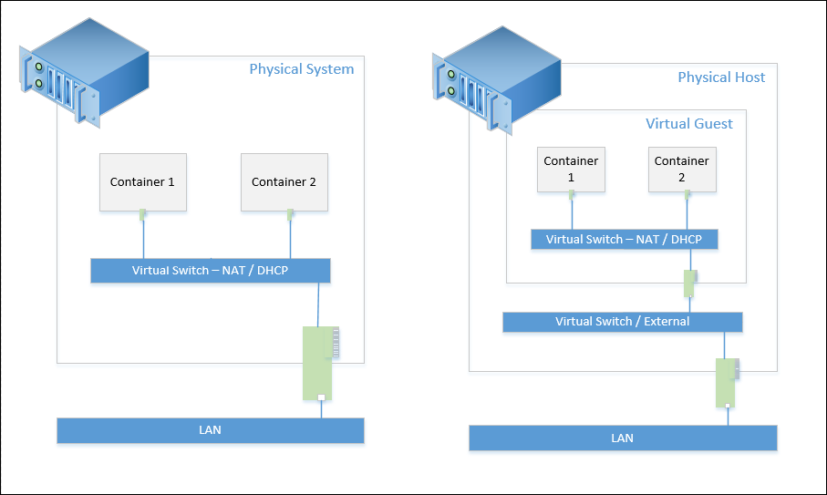
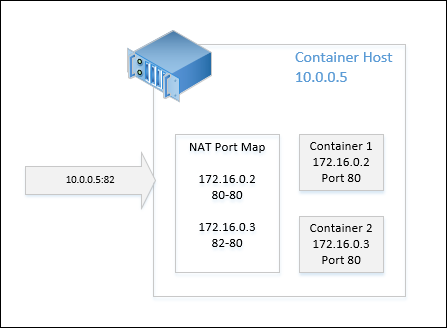

# Container Networking

Windows containers function similarly to virtual machines in regards to networking. Each container has a virtual network card, which is connected to a virtual switch, over which inbound and outbound traffic is routed. That’s said there are some distinct differences in networking a container vs. networking a virtual machine. This document will detail these differences and how to configure networking on a container host.

## Network Overview

When deploying a physical container host, the logical network layout will look very similar to that of a Virtual Machine host. The containers will connect to a virtual switch, which is connected to a physical network card. However, when a container host has been virtualized, the configuration is a bit different than a standard virtualized environment. In a virtualized configuration a container is connected to a virtual switch, which is connected to a virtual network card, which is connected to a virtual switch on the host, which is finally connected to a physical network card.

Containers also introduce the concept of network address translation. NAT in containers works very much like NAT in an internet service router. An IP Address is exposed on one end (the container host), and internal private addresses are assigned to internal endpoints (the containers). Each internal endpoint is access through the external address. This topic is discussed in detail in this document.

The below diagram depicts a physical and virtual container host.



## Containers IP Configuration

When deploying Windows Container infrastructure, you need to decide on a networking strategy for the Containers. Two options are available, assign IP addresses to the containers using network address translation, or assign IP address using a DHCP server. These methods for assigning IP addresses are controlled by the type of Virtual Switch that the container is connected to. A container host can contain multiple virtual switches, and a mixture of NAT and DHCP.

**Network Address Translation** – in this configuration the container host will be assigned an 'external' IP address that is reachable on the LAN. All containers will be assigned an 'internal' address that cannot be accessed on the LAN. To make the containers accessible, an external port of the host is mapped to an internal port of port of the container. These mappings are stored in a NAT port mapping table. The container is accessible on the specified internal port through the hosts address and external port. The benefit of NAT is that the container host can scale to hundreds or thousands of containers, while only using one externally available IP Address. The disadvantage in this configuration is the need to manage the NAT port mapping table.

**DHCP** – this configuration is similar to traditional system / virtual machine networking. In this configuration each container receives an IP Address from a DHCP server, and is accessible on this IP address. The advantage here is that a port mapping table is not maintained. The disadvantage is that the ability to scale to large numbers of containers is determined by the number of available addresses in the DHCP scope serving the containers.

## Configuring NAT

To configure the container host with NAT, follow these steps.

Create a Virtual Switch with a type of ‘NAT’. For more information on the **New-VMSwitch** Command, see the [New-VMSwitch Reference](https://technet.microsoft.com/en-us/library/hh848455.aspx).

```powershell
New-VMSwitch -Name "NAT" -SwitchType NAT -NATSubnetAddress "172.16.0.0/12"
```
Create the Network Address Translation Object. For more information on the **New-NetNat** command, see the [New-NetNat Reference](https://technet.microsoft.com/en-us/library/dn283361.aspx)

```powershell
New-NetNat -Name NAT -InternalIPInterfaceAddressPrefix "172.16.0.0/12" 
```

### Containers and NAT

When creating a Windows Container, a virtual switch can be selected for the container. When the container is connected to a virtual switch configured to use NAT, the container will receive a translated address.

This example creates a container connected to a NAT enabled virtual switch.

```powershell
New-Container -Name DemoNAT -ContainerImageName WindowsServerCore -SwitchName "NAT"
```

When the container has been started you can connect to the container and view the translated IP Address.

```powershell
[DemoNAT]: PS C:\> ipconfig
Windows IP Configuration
Ethernet adapter vEthernet (Virtual Switch-527ED2FB-D56D-4852-AD7B-E83732A032F5-0):
   Connection-specific DNS Suffix  . : corp.microsoft.com
   Link-local IPv6 Address . . . . . : fe80::384e:a23d:3c4b:a227%16
   IPv4 Address. . . . . . . . . . . : 172.16.0.2
   Subnet Mask . . . . . . . . . . . : 255.240.0.0
   Default Gateway . . . . . . . . . : 172.16.0.1
```

For more information on starting and connecting to a Windows Container see [Managing Contianers](./manage_containers.md).

### Manage Port Mapping

In order to access applications inside of a 'NAT enabled' container, port mappings need to be created between the container and container host. This process is managed with the **New-NetNatStaticMapping** command. To create the mapping, you need the IP address of the container, the ‘internal’ container port and an ‘external’ host port.

This example creates a mapping between port **80** of the host to port **80** of a container with IP address **172.16.0.2**.

```powershell
Add-NetNatStaticMapping -NatName "Nat" -Protocol TCP -ExternalIPAddress 0.0.0.0 -InternalIPAddress 172.16.0.2 -InternalPort 80 -ExternalPort 80
```

This example creates a mapping between port  **82** of the container host to port **80** of a container with IP address **172.16.0.3**.

```powershell
Add-NetNatStaticMapping -NatName "Nat" -Protocol TCP -ExternalIPAddress 0.0.0.0 -InternalIPAddress 172.16.0.3 -InternalPort 80 -ExternalPort 82
```
After the mappings have been created, the container applications can be accessed through the IP address of the host, and exposed external port. For example, the below diagram depicts a NAT configuration with a request targeting external port **82** of the container host. Based on the port mapping, this request would return the application being hosted in container 2.



A view of the request from an internet browser.


## Configure DHCP

To configure the container system so that containers receive an IP address from a DHCP server, create a virtual switch that is connected to a physical or virtual network adapter.

The following sample creates a virtual switch with the name DHCP using a network adapter named Ethernet.

```powershell
New-VMSwitch -Name DHCP -NetAdapterName Ethernet
```

If the container host is itself a virtual machine, you need to enable MacAddressSpoofing on the network adapter used as the container switch. This is completed with the **Set-VMNetworkAdapter** command and is run on the VM Host.

```powershell
Get-VMNetworkAdapter -VMName TP4FullLatest | Set-VMNetworkAdapter -MacAddressSpoofing On
```
The DHCP enabled switch can now be connected to a container, which is then capable of receiving a IP address from a DHCP server. In this configuration, application hosted inside of the container will be accessible on the IP Address assigned to the container from DHCP. 

## Container Network Adapters

Regardless of network configuration (DHCP or NAT), several command are available that enable managing a containers network adapter and virtual switch connections.

Manage a Containers Network Adapter

- Add-ContainerNetworkAdapter - Adds a network adapter to a container.
- Set-ContainerNetworkAdapter - Modifies a containers network adapter.
- Remove-ContainerNetworkAdapter - Removes a containers network adapter.
- Get-ContainerNetworkAdapter - Returns data about a containers network adapter.

Manage the connection between a containers network adapter and a virtual switch.

- Connect-ContainerNetworkAdapter - connects a container to a virtual switch.
- Disconect-ContainerNetworkAdapter - disconnects a container from a virtual switch.

For details on each of these command see the [Container PowerShell Reference]( https://technet.microsoft.com/en-us/library/mt433069.aspx).