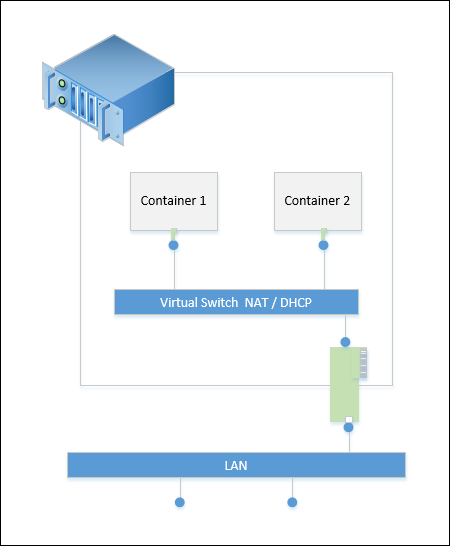

## Manage Windows Container Networking

When deploying Windows Container infrastructure, you need to decide on a networking strategy for the Containers. Two options are available, assign IP addresses to the containers using network address translation technology, or assign IP address using a DHCP server.

**Network Address Translation** – in this configuration the container host will be assigned an 'external' IP address that is reachable on the LAN. All containers will be assigned an 'internal' address that cannot be accessed on the LAN. To make the containers accessible, an external port of the host is mapped to an internal port of port of the container. These mappings are stored in a NAT port mapping table. The container is accessible through the hosts address and external port, which passes traffic to the associated port of the container. The benefit of NAT is that the container host can scale to hundreds of containers while only using one externally available IP Address.



**DHCP** – this configuration is similar to traditional system / virtual machine networking. In this configuration each container receives an IP Address from a DHCP server and is accessible on this IP address. The advantage here is that a port mapping table is not maintained.

## Configuring NAT

To configure the container host to support Network Address Translation to the container these items need to be completed.

Create a Virtual Switch with a type of ‘NAT’. 

```powershell
New-VMSwitch -Name "Virtual Switch" -SwitchType NAT -NATSubnetAddress "172.16.0.0/12"
```
Create the Network Address Translation Object. 

```powershell
New-NetNat -Name ContianerNAT -InternalIPInterfaceAddressPrefix "172.16.0.0/12" 
```

For more information on the New-VMSwitch Command see the [New-VMSwitch Reference](https://technet.microsoft.com/en-us/library/hh848455.aspx).

For more information on the **New-NetNat** command, see the [New-NetNat Reference]( https://technet.microsoft.com/en-us/library/dn283361(v=wps.630).aspx)

## Configure Containers with NAT

When creating a Windows Container, a virtual switch can be selected for the container. When the container is connected to a virtual switch configured to use network address translation, the container will receive a translated address.

This example creates a container and connects is to a NAT enabled virtual switch.

```powershell
PS C:\> New-Container -Name DemoNAT -ContainerImageName WindowsServerCore -SwitchName "Virtual Switch"
```

When the container has been started you can connect to the container and view the translated IP Address.

```powershell

[DemoNAT]: PS C:\> ipconfig
Windows IP Configuration
Ethernet adapter vEthernet (Virtual Switch-527ED2FB-D56D-4852-AD7B-E83732A032F5-0):
   Connection-specific DNS Suffix  . : corp.microsoft.com
   Link-local IPv6 Address . . . . . : fe80::384e:a23d:3c4b:a227%16
   IPv4 Address. . . . . . . . . . . : 172.16.0.2
   Subnet Mask . . . . . . . . . . . : 255.240.0.0
   Default Gateway . . . . . . . . . : 172.16.0.1
[DemoNAT]: PS C:\>  
```

For more information on starting and connecting to a Windows Container see [Managing Contianers](./manage_containers.md).

## Manage Port Mapping

In order to access applications inside of a container connected to a NAT enabled virtual switch, port mappings need to be created between the container and container host. This process is managed with the **New-NetNatStaticMapping** command. To create the mapping, you need the NAT assigned IP address of the container, the ‘internal’ container port and an ‘external’ host port.

This example creates a mapping named **ContianerNat**, that maps port **80** of the host to port **80** of a container with IP address 172.16.0.2.

```powershell
Add-NetNatStaticMapping -NatName "ContianerNat" -Protocol TCP -ExternalIPAddress 0.0.0.0 -InternalIPAddress 172.16.0.2 -InternalPort 80 -ExternalPort 80
```

This example created a mapping named **ContainerNat2** that maps port **82** of the container host to port **80** of a container with IP address 172.16.0.3.

```powershell
Add-NetNatStaticMapping -NatName "ContianerNat" -Protocol TCP -ExternalIPAddress 0.0.0.0 -InternalIPAddress 172.16.0.3 -InternalPort 80 -ExternalPort 82
```
After the mappings have been created, the container applications can be accessed through the IP address of the host and external port, for example **10.0.0.5:80** and **10.0.0.5:82**.


## Configure DHCP

To configure the container system so that containers receive an IP address from a DHCP server, create a virtual switch that is connected to a physical or virtual network adapter.

The following sample creates a virtual switch with the name DHCP using a network adapter named Ethernet.

```powershell
New-VMSwitch -Name DHCP -NetAdapterName Ethernet
```

If the container host is itself a virtual machine you will need to enable MacAddressSpoofing for the network adapter used as the container switch. This is completed with the **Set-VMNetworkAdapter** command and is run on the VM Host.

```powershell
Get-VMNetworkAdapter -VMName TP4FullLatest | Set-VMNetworkAdapter -MacAddressSpoofing On
```
The DHCP enabled switch can now be connected to a container, which is then capable of receiving a IP address from a DHCP server.
