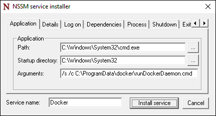
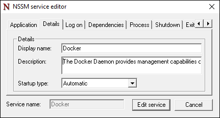
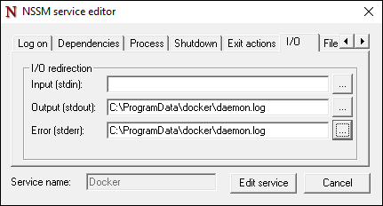

## Install Docker Service

The Docker Daemon and Client is part of an open source software project founded by docker.com. Docker has driven functionality and consistence into the creation and management of container technology. Windows Containers and Container Images can be created and managed using the Docker tools. 

The Docker Daemon and Client are not shipped with Windows out of the box, rather need to be installed. This document will walk through manually installing the Docker daemon and Docker client. Automated methods for competing these task will also be provided.

## Install the Docker Client / Daemon for Windows:

The Docker Daemon and Client have been developed in the Go language. At this time, docker.exe does not install as a Windows Service. There are several methods that can be used to create a service, we will give one example here using nssm.exe. 

Download docker.exe from "https://aka.ms/ContainerTools" and copy it into **c:\windows\system32** of your container host.

Create a folder **c:\programdata\docker** and copy **runDockerDaemon.cmd** into this folder.

Download nssm.exe from https://nssm.cc/release/nssm-2.24.zip, extract the files, and copy **nssm-2.24\win64\nssm.exe** into the **c:\windows\system32** directory.

Open a command prompt and enter **nssm install**.

- **Path:** C:\Windows\System32\cmd.exe
- **Startup Directory:** C:\Windows\System32
- **Arguments:** /s /c C:\ProgramData\docker\runDockerDaemon.cmd



- **Display name:** Docker
- **Description:** The Docker Daemon provides management capabilities of containers for docker clients



- **Output (stdout):** C:\ProgramData\docker\daemon.log
- **Error (stderr):** C:\ProgramData\docker\daemon.log



## Automated Installation of the Docker Service

## Removing the Docker Service

If following this guide for creating a Windows service from docke.exe, the following command will remove the service.

```powershell
PS C:\ sc.exe delete Docker
[SC] DeleteService SUCESS
```


## Docker Daemon Startup Options