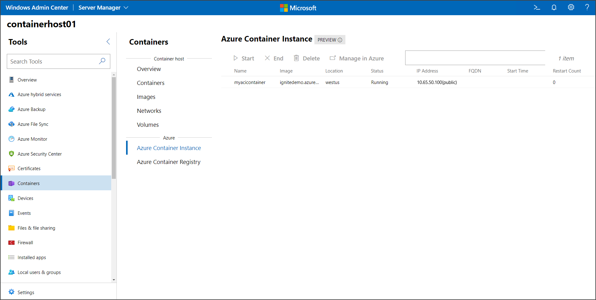

# Manage Azure Container Instances using Windows Admin Center

This topic describes how to manage Azure Container Instances (ACI) using Windows Admin Center. Azure Container Instances is a solution for any scenario that can operate in isolated containers, without orchestration.

>[!Note]
>An Azure subscription is required to run the steps in this tutorial. For more information on how to connect your Windows Admin Center instance to Azure, check out the [documentation](https://docs.microsoft.com/en-us/windows-server/manage/windows-admin-center/azure/azure-integration).

Windows Admin Center allows you to perform basic management of Azure Container Instances, including listing the existing container instances, starting and stopping an instance, removing instances, and opening the Azure Portal for advanced management.

With the container instanes listed, you can perform the following operations:

- Start: To start an already existing instance that is currently stopped.
- End: To stop a running instance.
- Delete: To delete an instance. This is irreversible and will remove any configuration made to the instance.
- Manage in Azure: This will open the Azure Portal pane to manage the selected container instance on a new browser tab.

## Next steps

> [!div class="nextstepaction"]
> [Manage Azure Container Registry on Windows Admin Center](./wac-acr.md)