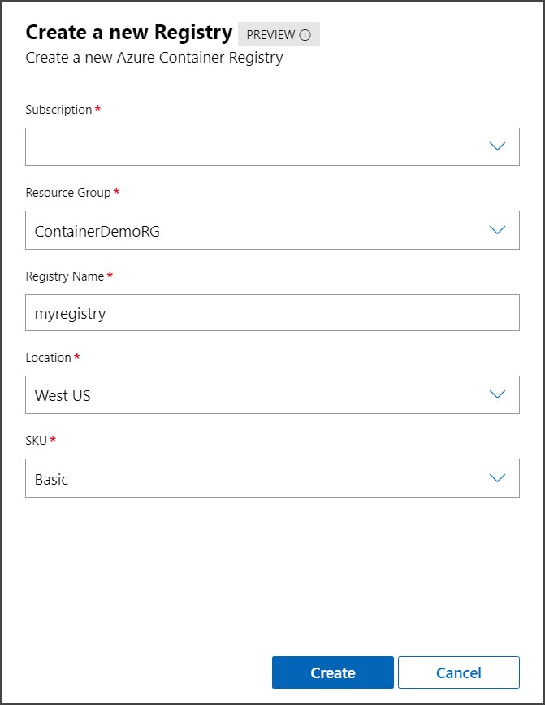
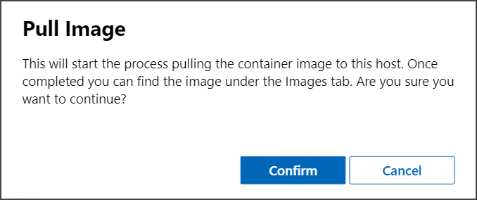
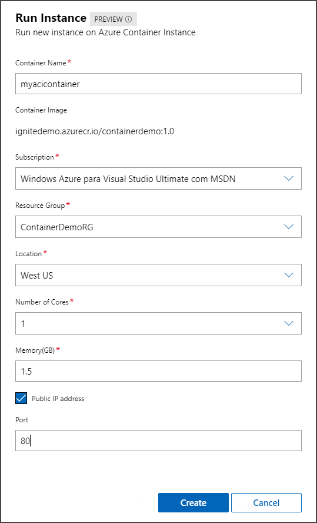

# Manage Azure Container Registry using Windows Admin Center

This topic describes how to manage Azure Container Registry (ACR) using Windows Admin Center. Azure Container Registry allows you to build, store, and manage container images and artifacts in a private registry for all types of container deployments.

>[!Note]
>An Azure subscription is required to run the steps in this tutorial. For more information on how to connect your Windows Admin Center instance to Azure, see [Configuring Azure integration](/windows-server/manage/windows-admin-center/azure/azure-integration).

Windows Admin Center allows you to perform basic management of Azure Container Registry, such as:

- List registries and images
- Create new registries
- Remove images
- Pull images to your container host
- Start new containers on Azure Container Instances from images stored in Azure Container Registry

Using Windows Admin Center to manage ACR, you can prepare the Azure location to which you can push images directly from the **Images** tab under **Container host**. To get started, follow the steps below:

1. Open your Windows Admin Center instance and select the container host.
2. Under **Tools** in the left pane, scroll down and select the **Containers** extension.
3. Open the **Azure Container Registry** tab under **Azure**.

    

## Manage registries and images

To create a new registry, under **Azure Container Registry**, select **Create New Registry**.

Under **Create a new registry**, select the subscription you want to use to create a new registry and the Resource Group you want to allocate the registry. Next, provide a registry name, location and SKU. For more information on pricing and features on each SKU, see [ACR documentation](/azure/container-registry/). Click **Create** to create the new registry. Once completed, Windows Admin Center will notify you if the operation is completed successfully, and then you'll see the new registry listed.

Once registries and images are listed, you can remove an existing image or pull it to the container host for local use. To pull an image, select the image you want to pull and click **Pull Image**:

After the pull process completes, Windows Admin Center will notify you, and the image will be available for use on the **Images** tab under **Container host**.

Finally, you can run a new container that's based on an image hosted on ACR. To get started, select the image you want to run and click **Run Instance**:

Under **Run Instance**, you need to provide a container name, which subscription to use, and the resource group and location you want to run this instance.

Next, provide the CPU and memory allocation for this instance as well as the port you want to open, if needed. Click **Create** and Windows Admin Center sends the command to Azure to run the instance. You can check the status of the container instance on the **Azure Container Instance** tab.

## Next steps

> [!div class="nextstepaction"]
> [Manage Azure Container Instance on Windows Admin Center](./wac-aci.md)
