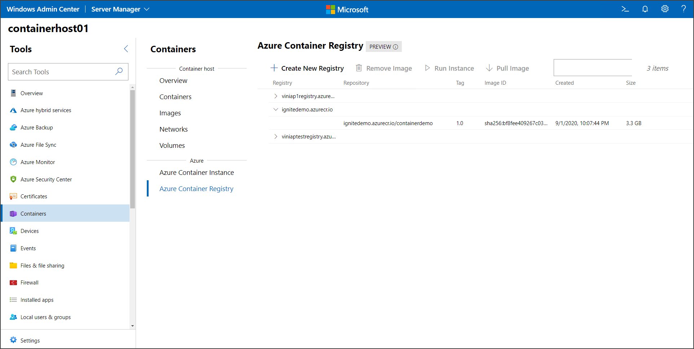

# Manage Azure Container Registry using Windows Admin Center

This topic describes how to manage Azure Container Registry (ACR) using Windows Admin Center. Azure Container Registry allows you to build, store, and manage container images and artifacts in a private registry for all types of container deployments. 

>[!Note]
>An Azure subscription is required to run the steps in this tutorial. For more information on how to connect your Windows Admin Center instance to Azure, check out the [documentation](https://docs.microsoft.com/en-us/windows-server/manage/windows-admin-center/azure/azure-integration).

Windows Admin Center allows you to perform basic management of Azure Container Registry, including listing registries and images, creating new registries, removing images, pulling images to your container host, and starting new containers on Azure Container Instance from images stored in Azure Container Registry.

Managing ACR from Windows Admin Center also allows you to prepare the Azure location on which you can push images directly from the Images tab under Container host. To get started, open your Windows Admin Center instance, target your container host, and open the Azure Container Registry tab on the Containers extension under Azure.

## Managing registries and images

To create a new registry, on the Azure Container Registry menu click Create New Registry:

On the Create new Registry menu, select the subscription you want to use to create a new registry. Select the Resource Group you want to allocate the registry. Next, provide a registry name, location and SKU. More information on pricing and features on each SKU can be fund in the [ACR documentation](https://docs.microsoft.com/en-us/azure/container-registry/). Click Create to create the new registry. Once completed Windows Admin Center will inform if the operation completed sucessfully and you'll see the new registry listed.

Once registries and images are listed you can remove an existing image or pull it to the container host for local use. To pull an image, select the image you want to pull and click Pull Image:

Once the pull process completes, Windows Admin Center will notify you and the image will be available for use on the Images tab under Container Host.

Finally, you can run a new Container based on an image hosted on ACR. To get started, select the image you want to run and click Run Instance:

On the Run Instance menu, you need to provide a container name, which subscription to use, and the resource group and location you want to run this instance.

Next, you can provide the CPU and Memory allocation for this instance as well as the port you want to open, if needed. Click Create and Windows Admin Center wil send the command to Azure to run the instance. You can check the status of the container instance on the Azure Container Instance tab.

## Next steps

> [!div class="nextstepaction"]
> [Manage Azure Container Instance on Windows Admin Center](./wac-aci.md)