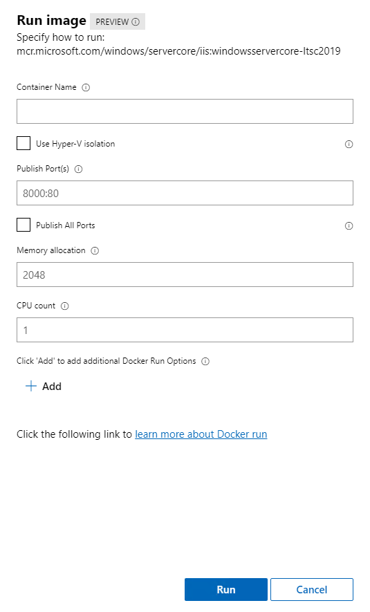

# Run new containers using Windows Admin Center

Windows Admin Center helps you run containers locally on your container host.

1. In Windows Admin Center with the **Containers** extension installed, open the container host you want to manage.
2. Under **Tools** in the left pane, select the **Containers** extension.
3. Select the **Images** tab under Container host.

    

4. Select the image you want to run and click **Run**.

    

5. Under **Run image**, you can specify the container-related configuration:

    - Container name: This is an optional input. You can provide a container name to help you track the container you created - otherwise, Docker will provide a generic name to it.
    - Isolation type: You can choose to use hypervisor instead of the default process isolation. For more information on isolation modes for Windows Containers, see [Isolation Modes](../manage-containers/hyperv-container.md).
    - Publish ports: By default, Windows containers use NAT for the networking mode. This means a port on the container host will be mapped to the container. This option allows you to specify that mapping.
    - Memory allocation and CPU count: You can specify how much memory and how many CPUs that a container should be able to use. This option does not allocate the assigned memory or CPU to the container. Rather, this option specifies the maximum amount a container will be able to allocate.
    - Add: You can also append Docker run parameters that are not in the UI, such as -v for persistent volume. For more information on available Docker run parameters, see [Docker documentation](https://docs.docker.com/engine/reference/commandline/run/).

6. Once you've finished configuring the container, select **Run**. You can view the status of the running containers on the **Containers** tab:

    

## Next steps

> [!div class="nextstepaction"]
> [Manage Azure Container Registry on Windows Admin Center](./wac-acr.md)
