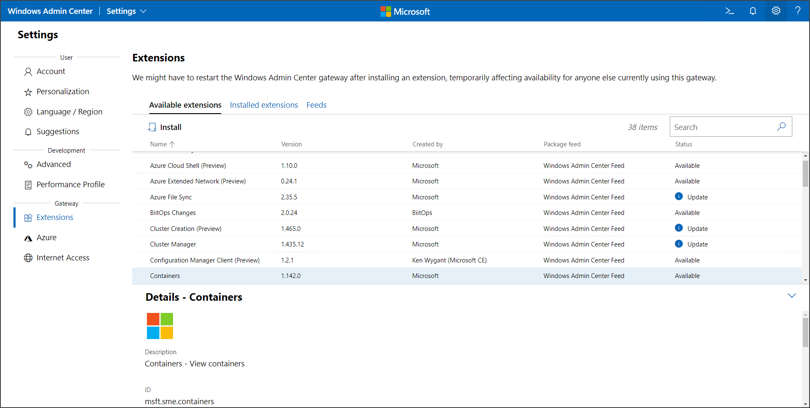

# Configure the Containers extension on Windows Admin Center

This topic describes how to configure the Containers extension on Windows Admin Center. For more information on how to install and configure Windows Admin Center as well as how to target remote servers, see the [Windows Admin Center](https://aka.ms/wacdocs) documentation.

## Install the Containers extension on Windows Admin Center

1. On your Windows Admin Center instance, select the **Settings** button in the top-right, and then, in the left pane, under **Gateway**, select **Extensions**.
2. On the **Available extensions** tab, select the **Containers** extension from the list.
3. Click **Install** to install the extension.

 

Windows Admin Center will refresh and once completed, the extension will appear under the **Installed extensions** tab.

## Next steps

> [!div class="nextstepaction"]
> [Manage container images on Windows Admin Center](./wac-manage.md)