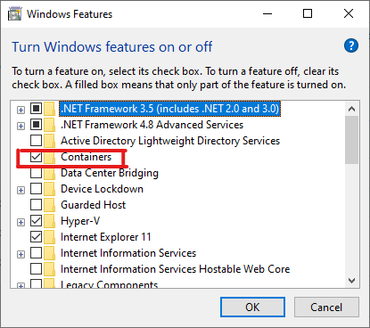

# DirectX Container Sample

This sample demonstrates containerizing and running a DirectX workload with GPU acceleration. Specifically, we use the [WinMLRunner](https://github.com/Microsoft/Windows-Machine-Learning/tree/master/Tools/WinMLRunner) machine learning inference app. WinMLRunner is a command-line tool that evaluates trained models on tensor or image inputs. For the purposes of demonstrating GPU acceleration, this sample uses the app’s performance benchmarking mode rather than providing real input. 

## Requirements

For this demo, your environment must meet the following requirements:

* The container host must be running Windows Server 2019 or Windows 10, version 1809 or newer.
* The container host must be running Docker Engine 19.03 or newer.
* The container host must have a GPU running display drivers version WDDM 2.5 or newer.
* The `Containers` feature must be enabled.

To enable the `Containers` feature, from the control panel launch `Turn Windows features on or off` and check the appropriate box.



To check the WDDM version of your display drivers, run the DirectX Diagnostic Tool (dxdiag.exe) on your container host. In the tool’s “Display” tab, look in the “Drivers” section as indicated below.


Additional container requirements to take advantage of GPU acceleration:

* The container base image must be mcr.microsoft.com/windows:1809 or newer. Windows Server Core and Nano Server container images are not currently supported.
* The container must be run in process isolation mode. Hyper-V isolation mode is not currently supported.

## Set up Docker

To run this sample, you’ll need a version of Docker that supports the `--device` command-line option for Windows containers. Follow the instructions below according to the version of Windows your host is running.

#### Windows 10 Pro and Enterprise

Install the latest release of Docker by following Docker's installation instructions on their [docs](https://docs.docker.com/install/).

#### Windows Server

Use the DockerMsftProvider to install Docker EE. From PowerShell, execute the following command:

```PowerShell
Install-Module -Name DockerMsftProvider -Repository PSGallery -Force
Install-Package -Name docker -ProviderName DockerMsftProvider
Restart-Computer -Force
```

## Run the demo

Copy the Dockerfile from this repo. Open a new PowerShell window, navigate to the directory where you downloaded the Dockerfile, and run the following:

```PowerShell
docker build . -t winml-runner
```

This builds the demo container image. Docker will acquire the WinMLRunner executable from the [Windows ML samples repository](https://github.com/Microsoft/Windows-Machine-Learning), along with a pre-trained machine learning model from the [ONNX Model Zoo](https://github.com/onnx/models).

Once the container image is built, you can run the container. Open a terminal and execute the following:

```PowerShell
docker run --isolation process --device class/5B45201D-F2F2-4F3B-85BB-30FF1F953599 winml-runner
```

This starts a new container with the demo image. The container invokes the WinMLRunner executable and instructs it to run in performance benchmarking mode, where no user input is required. The app evaluates the included machine learning model 100 times with mock input data, first using an optimized CPU implementation, then using a GPU-accelerated implementation. Meanwhile, it measures and reports some performance metrics. (See [WinMLRunner](https://github.com/Microsoft/Windows-Machine-Learning/tree/master/Tools/WinMLRunner) for details.)

## Observe the results

The key pieces of output to observe are the *Average Evaluate* times reported for CPU and GPU. (Because the up-front costs to prepare a model for evaluation differ significantly between CPU and GPU, it’s generally best to use the average evaluation time over many iterations to estimate overall throughput.) On most systems, this demo should show much faster average evaluation speeds on GPU than on CPU, though of course the speedup factor will depend on your system’s specific hardware. In general, the difference between CPU and GPU evaluation speeds also depends on the specific model being evaluated.

Finally, note that if GPU acceleration is not available in the container (for example, if your environment does not meet all the requirements, or if you omit the `--device` parameter), then WinMLRunner will use Microsoft’s general purpose CPU-based renderer for its “GPU” evaluation, which is currently much slower than WinML’s optimized CPU path. In this case, the tool will report much slower speeds on “GPU.” To avoid this, make sure you follow the steps above correctly, and make sure you *don’t* see “Creating Session with GPU: Microsoft Basic Render Driver” in the container’s output. Instead you should see the name of a real GPU from your GPU manufacturer.