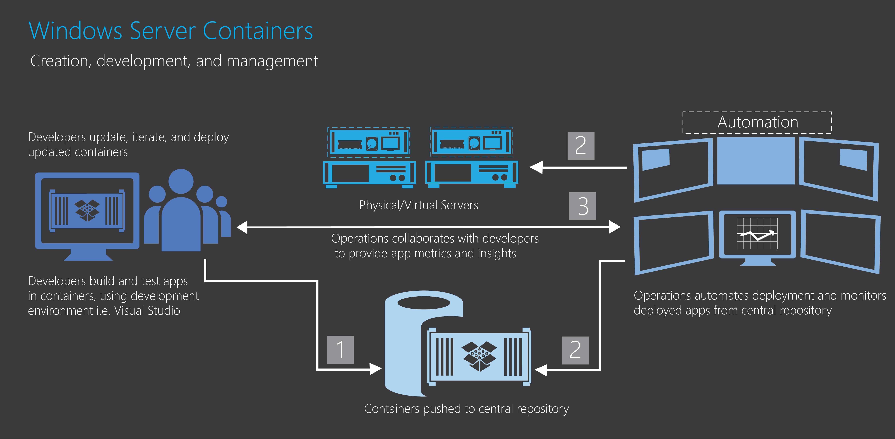

ms.ContentId: fbd49f81-b6cb-4030-9296-413d68a9428f
title: Container Ecosystem

# Building a Container Ecosystem #

Windows containers are a small component in a bigger picture for developers and system administrators.
Besides isolation, most users will need some way to manage containers, share containers, develop apps that may run in containers, or even orchastrate resource division across many containers.

## Developer Ecosystem ##

Containers make it easy for developers to produce applications which evolve rapidly and organically by providing equally agile application packaging and isolation.   

Using containers, a developer can begin writing an application, containerize that application including the dev environment, and pass the container to someone else.  When they start the container, the entire environment is there and ready to use.  Because containers can be imported and exported easily based on container definitions, they can also be stores in a central repository where container definitions are sharable, searchable, and modifyable.

Useful for iterative development, test frameworks, and numerous other applications.

## Hosting Ecosystem ##

Oppertunity for high density hosting in situations where having a shared kernel is not a security concern.  If it is a security concern, use a VM as the trust boundary then containers within the VM.
